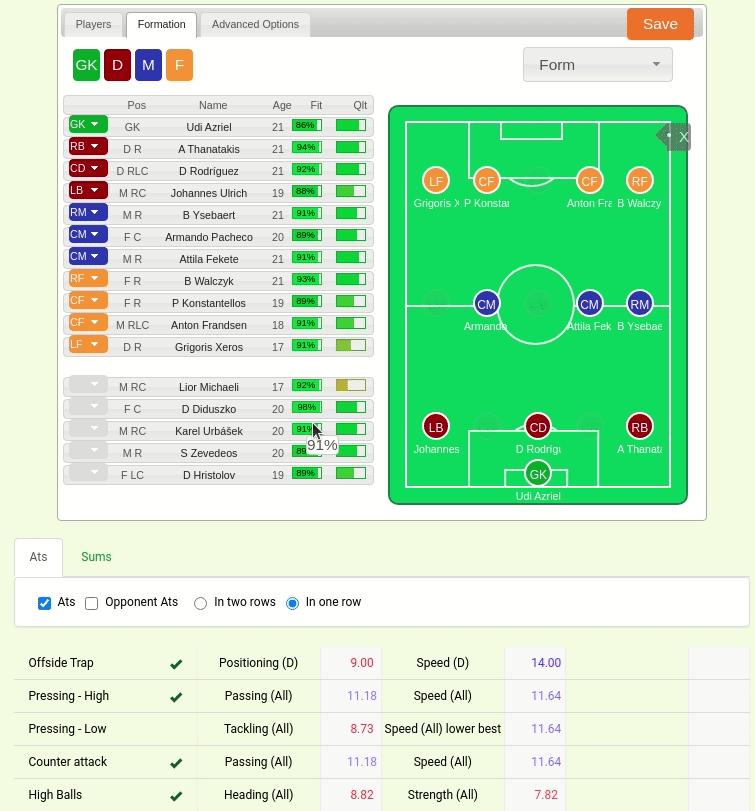
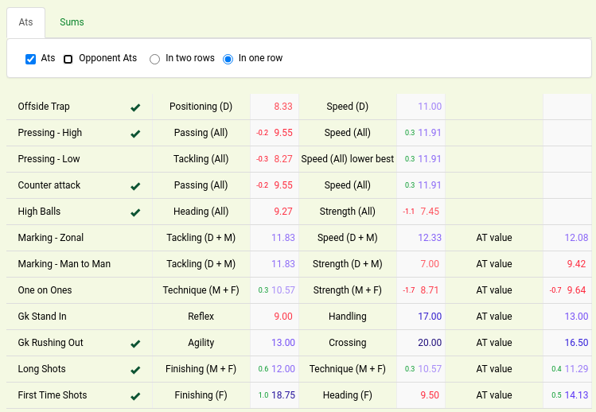
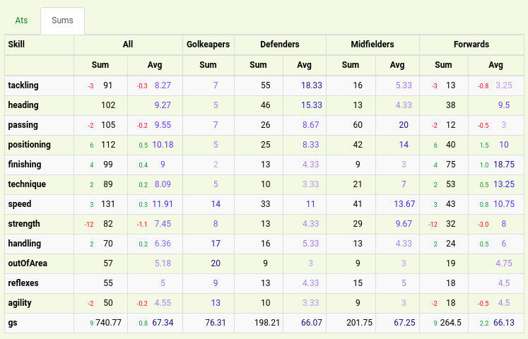
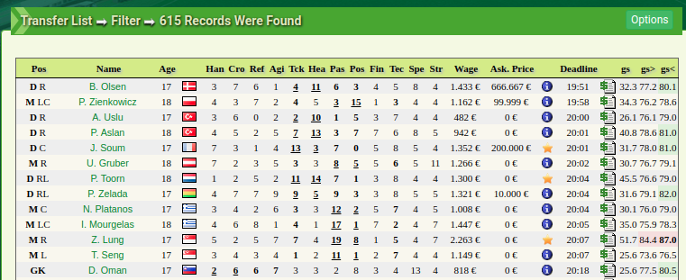
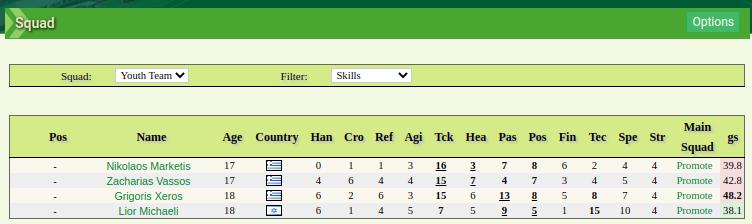
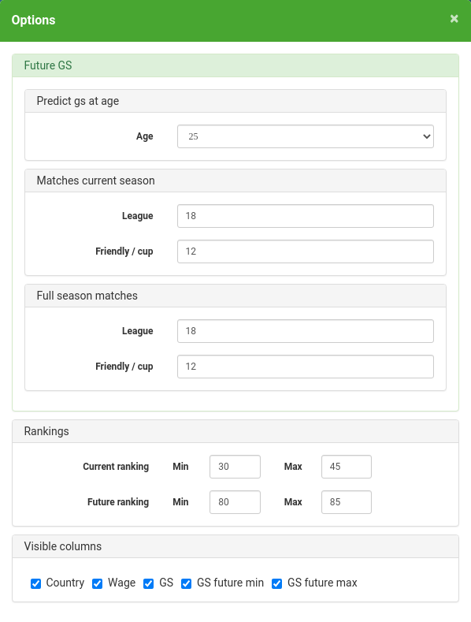

# PmTrick

PmTrick is browser extension for the [Planetarium Manager online football manager game](https://www.pmanager.org), currently available for Firefox & Google Chrome.

# Features

## Advanced tactics helper

Show advanced tactics calculated values directly on the tactic editor's page.



### Advanced tactics



### Skills stats



## GS columns on transfer list and team players list

Columns are visible on transfer list in Advanced View and on team players list with 'Skills' filter.

### Transfer list

On transfer list visible are current and future GS.
Future GS calculated is based on the player's potential for the minimum (gs>) and maximum possible value (gs<).

Formula for GS calculation:

```
gs = (
    mainSkills * 61.02 +
    secondarySkills * 20.34 +
    physicalSkills * 15.25 +
    (tertiarySkills * 1.13) / 3
) / 40
```

Skills trained in the future are added first to the main skills (to 40) and then to the secondary, phisical and tertiary.



### Team players

Currently, only the current GS is visible in the team player list.



### Options

Options avaiable on transfer list and tem player list:

-   Future GS options:
    -   Age for which GS is predicted
    -   Expected number of matches played in the current season
    -   Expected number of matches played in a full season
-   Rankings - The minimum and maximum value of GS for which the field will be marked with a color (green / red) and calulated place for GS value in the rankings.
    -   Ranking place (visible in tooltip):
        -   1 - gs greater then max
        -   2-10 - gs between min and max
        -   last - gs lower then min
    -   Ranking colors:
        -   1 - red background and bold text
        -   2-6 - red background
        -   6-10 - green background
-   Visible columns - allows to hide some columns



# Problems?

Please post and view issues on [GitHub](https://github.com/immament/pmtrick/issues)

# Dev

[More informations](docs/dev.md)
